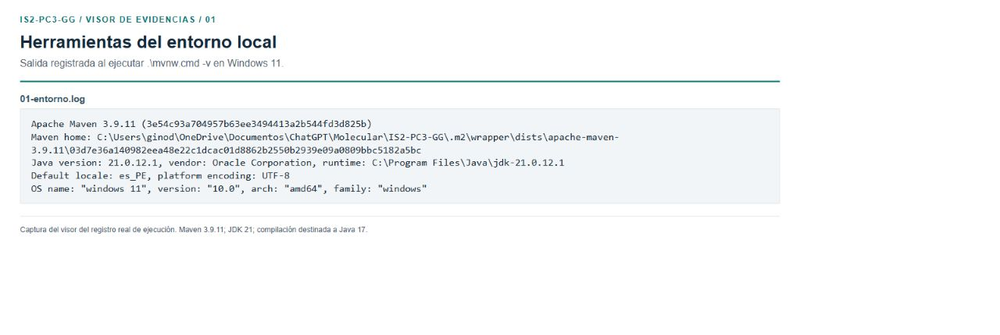
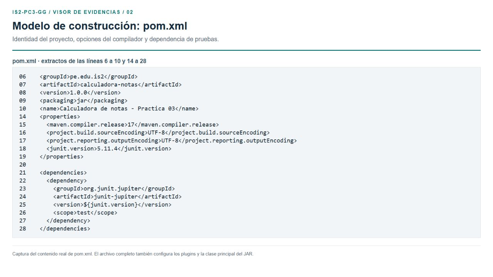
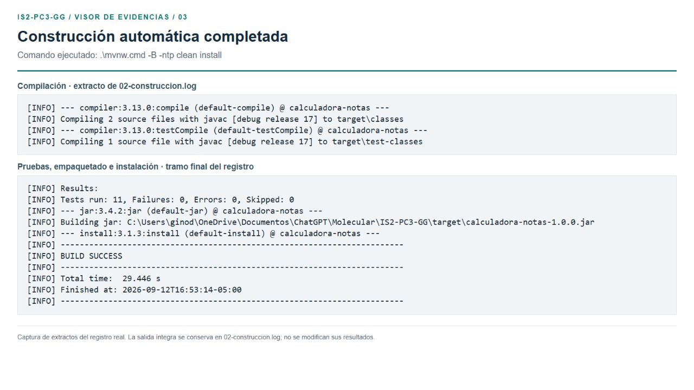
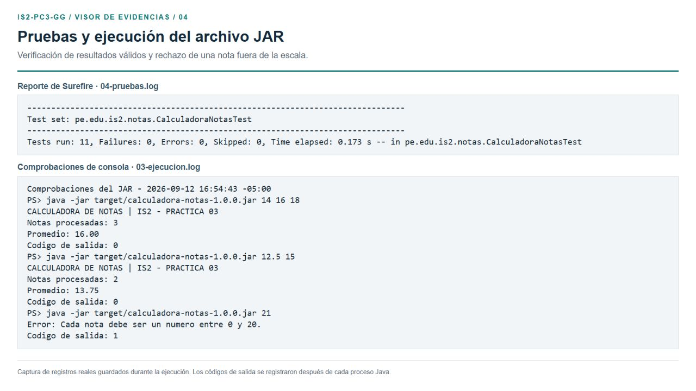
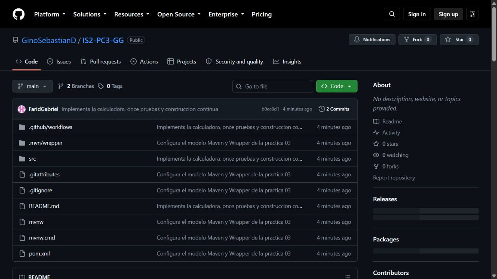
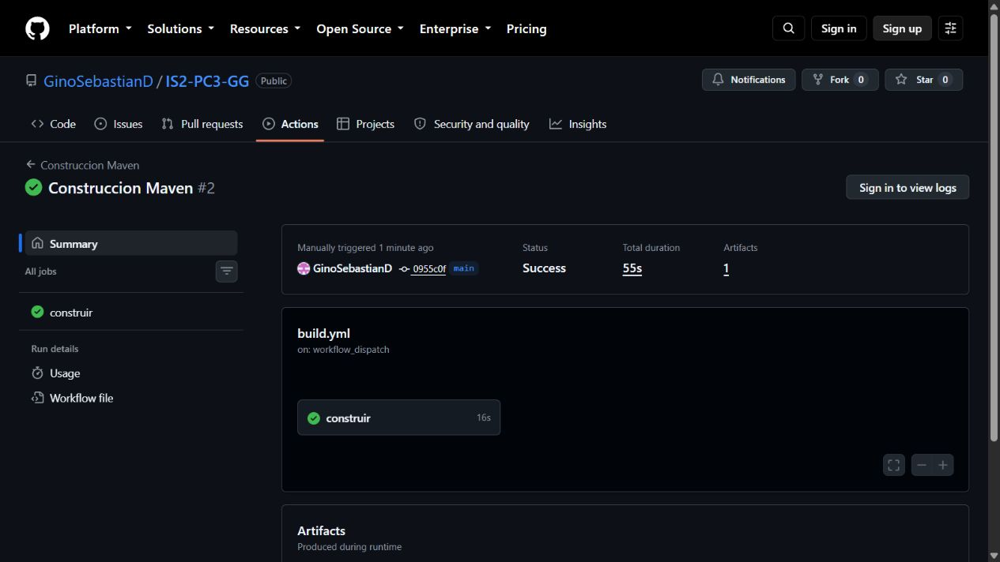

# Práctica 03: construcción automática

Ingeniería de Software II | Repositorio: GinoSebastianD/IS2-PC3-GG | 12/09/2026

## 1. Objetivo y configuración de la herramienta

Construir un proyecto Java mediante un modelo de Maven que centralice la identificación del software, las opciones de compilación y las dependencias. El proyecto implementa una calculadora de promedio simple de notas de 0 a 20 y permite comprobar la compilación, las pruebas y el empaquetado.

Se seleccionó **Apache Maven 3.9.11** por su configuración declarativa en XML y su estructura convencional. El entorno comprobado es Windows 11 con **JDK 21.0.12.1**. Se fija Java 17 como versión de destino del compilador. El Wrapper conserva la versión de Maven utilizada por el proyecto [1, 2].

**Configuración paso a paso.** Instalar un JDK 17 o posterior desde su proveedor oficial; establecer JAVA_HOME en la carpeta del JDK y añadir bin a PATH. Abrir PowerShell, comprobar Java, clonar el repositorio y consultar la versión de Maven:

```text
java -version
javac -version
git clone https://github.com/GinoSebastianD/IS2-PC3-GG.git
cd IS2-PC3-GG
.\mvnw.cmd -v
```

Figura 1. Captura del visor de la salida real de Maven: versión, JDK y sistema operativo.



**Incidencia resuelta.** La descarga inicial del Wrapper falló por una conexión TLS del entorno. Se descargó Maven desde Maven Central, se verificó su SHA-512 y se preparó la caché local. Después se ejecutó el Wrapper original. El registro del fallo y la explicación están en el repositorio.

## 2. Modelo de construcción del proyecto

El archivo **pom.xml** identifica el artefacto como **pe.edu.is2:calculadora-notas:1.0.0** y define el empaquetado JAR. La propiedad maven.compiler.release=17 solicita clases compatibles con Java 17; UTF-8 fija la codificación. JUnit Jupiter 5.11.4 tiene alcance test y se utiliza únicamente durante las pruebas.

Figura 2. Extractos del pom.xml real con información del proyecto, compilador y dependencia de pruebas.



La estructura separa producción y pruebas. Maven localiza ambos conjuntos de archivos sin declarar rutas manuales [1].

```text
pom.xml
mvnw / mvnw.cmd
.mvn/wrapper/maven-wrapper.properties
src/main/java/pe/edu/is2/notas/
  App.java
  CalculadoraNotas.java
src/test/java/pe/edu/is2/notas/
  CalculadoraNotasTest.java
```

**Plugins configurados:** Clean 3.4.0, Resources 3.3.1, Compiler 3.13.0, Surefire 3.5.2, JAR 3.4.2 e Install 3.1.3. El plugin JAR agrega la clase principal pe.edu.is2.notas.App al manifiesto; por ello se puede utilizar java -jar. No se necesitan dependencias externas en tiempo de ejecución.

## 3. Construcción automática y resultados

Desde la raíz del proyecto se ejecutó el siguiente comando. La opción -B desactiva la interacción y -ntp reduce los mensajes de progreso de descarga:

```text
.\mvnw.cmd -B -ntp clean install
```

**Secuencia:** clean elimina los productos previos; el ciclo solicitado por install valida el modelo, compila, ejecuta las pruebas, empaqueta, recorre verify e instala el artefacto en el repositorio local [3]. No fue necesario compilar cada archivo Java manualmente.

Figura 3. Captura de extractos de la construcción real: compilación para Java 17, pruebas y BUILD SUCCESS.



**Resultado comprobado:** se compilaron dos archivos de producción y uno de pruebas. Surefire ejecutó **11 pruebas, sin fallos, errores ni omisiones**. Maven creó el JAR y finalizó correctamente en **29.446 segundos**, el 12/09/2026 a las 16:53:14 (UTC-5).

El artefacto es **target/calculadora-notas-1.0.0.jar**; los reportes quedan en **target/surefire-reports/**. En esta ejecución se aisló el repositorio Maven en .m2/repository mediante MAVEN_OPTS. En una configuración normal se utiliza el repositorio del usuario, habitualmente ~/.m2/repository.

El comando install registra el artefacto localmente. La publicación del código en GitHub es una operación independiente realizada con Git.

## 4. Pruebas automatizadas y ejecución del JAR

La suite verifica el promedio de varias notas, decimales, límites 0 y 20, una sola nota, lista vacía, lista nula y cinco valores inválidos: -1, 20.1, NaN e infinitos positivo y negativo. Se utilizan aserciones numéricas y comprobación de excepciones; los cinco casos inválidos corresponden a una prueba parametrizada [4].

Figura 4. Reporte de Surefire y capturas del registro de ejecución del JAR con entradas válidas e inválidas.



**Comprobación funcional:** las notas 14, 16 y 18 producen 16.00; las notas 12.5 y 15 producen 13.75. Ambas ejecuciones terminan con código 0. La nota 21 se rechaza y el proceso termina con código 1. Estas verificaciones confirman que el archivo empaquetado se puede ejecutar y aplica la validación esperada.

```text
java -jar target/calculadora-notas-1.0.0.jar 14 16 18
java -jar target/calculadora-notas-1.0.0.jar 12.5 15
java -jar target/calculadora-notas-1.0.0.jar 21
```

**Alcance de las evidencias.** Las figuras 1 a 4 son capturas del visor de archivos reales de configuración y registros guardados; no son una ventana de terminal interactiva. Los archivos .log íntegros permiten contrastar los resultados y los extractos mostrados.

## 5. Control de versiones y publicación en GitHub

El proyecto se publicó en <a href="https://github.com/GinoSebastianD/IS2-PC3-GG" color="#087B78">github.com/GinoSebastianD/IS2-PC3-GG</a>. Se conserva **main** como rama principal y **codex/practica-03** como rama de implementación. La configuración y el código con sus pruebas se registraron en commits separados.

Figura 5. Captura directa del repositorio publicado en GitHub, registrada durante la preparación del informe.



**Commits de implementación:** f4ef23a configura el modelo Maven y el Wrapper; b0ec8d1 incorpora la calculadora, once pruebas y el flujo de construcción. La documentación y el PDF se agregan en una entrega posterior a esa captura. El historial completo se consulta en GitHub.

```text
git switch -c codex/practica-03
git add src .github README.md
git commit -m "Implementa la calculadora, once pruebas y construccion continua"
git switch main
git merge --ff-only codex/practica-03
git push -u origin main codex/practica-03
```

La entrega incluye pom.xml, código Java, pruebas, scripts del Wrapper, tutorial README, este informe y sus capturas. target/ y las cachés se excluyen del control de versiones porque se regeneran con Maven. Los scripts oficiales del Wrapper conservan sus avisos de licencia.

## 6. Automatización adicional y conclusiones

El flujo **Construccion Maven** se ejecutó correctamente en GitHub Actions sobre Java 17. La ejecución <a href="https://github.com/GinoSebastianD/IS2-PC3-GG/actions/runs/34721731701" color="#087B78">34721731701</a>, iniciada manualmente para verificar la entrega, confirma la construcción en un entorno remoto. El archivo .github/workflows/build.yml también contempla push y pull_request, y define descarga del código, configuración de Java, clean install, ejecución del JAR y conservación de artefactos.

Figura 6. Captura directa del estado de GitHub Actions en la ejecución consultada.



**Conclusiones.** El modelo de Maven permitió centralizar las opciones del proyecto y construir el software con una sola invocación. La gestión de JUnit y los plugins hizo posible comprobar automáticamente el comportamiento antes del empaquetado. El JAR funcionó con los valores previstos y rechazó una entrada fuera de rango. El Wrapper y el versionado de la configuración facilitan repetir el proceso en otro equipo con un JDK compatible.

## Referencias

[1] Apache Maven. <a href="https://maven.apache.org/guides/getting-started/maven-in-five-minutes.html" color="#087B78">Maven in 5 Minutes</a>. Estructura y configuración inicial.

[2] Apache Maven. <a href="https://maven.apache.org/tools/wrapper/" color="#087B78">Maven Wrapper</a>. Configuración de la versión de Maven y descarga de la distribución.

[3] Apache Maven. <a href="https://maven.apache.org/guides/introduction/introduction-to-the-lifecycle.html" color="#087B78">Introduction to the Build Lifecycle</a>. Fases de construcción e instalación.

[4] JUnit. <a href="https://docs.junit.org/5.11.4/user-guide/" color="#087B78">JUnit 5.11.4 User Guide</a>. Pruebas y parametrización.

Enunciado del curso: Pr_3_Automatic_Build.pdf, Práctica 03, Construcción automática. Evidencias de ejecución y código: repositorio de la entrega. Consulta y ejecución: 12/09/2026.
